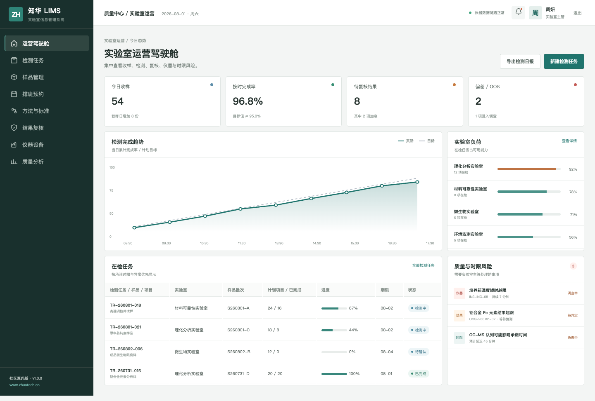
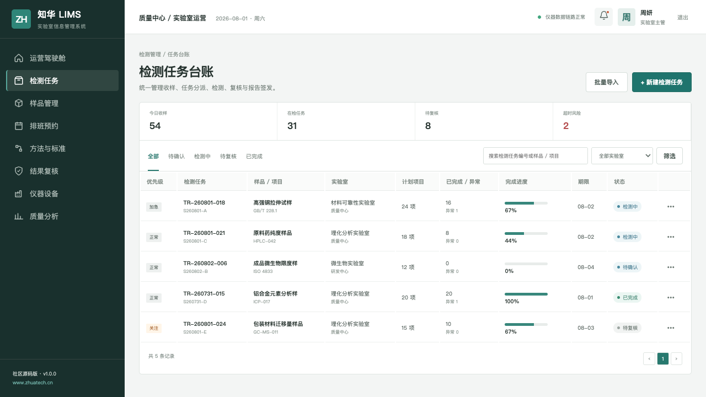
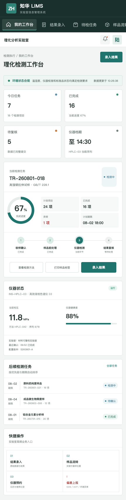

# ZhuaTech LIMS｜知华科技实验室信息管理系统

> 把样品、方法、仪器、原始数据和报告放进同一条可审计链路。

[](backend/pom.xml) [](frontend/package.json) [](compose.yaml) [](LICENSE)

ZhuaTech LIMS 是知华科技（上海如静知华信息科技有限公司）发布的实验室信息管理系统社区源码版，适合学习实验室流程数字化、数据完整性和 Java 前后端分离工程。访问[知华科技官网](https://www.zhuatech.cn/)了解企业信息化、私有化部署与定制服务。

## 一条真实的检测闭环

```text
委托登记 → 收样确认 → 任务分派 → 样品前处理 → 仪器检测
    ↑                                           ↓
留样管理 ← 报告签发 ← 电子签名 ← 结果复核 ← 原始数据
```

社区版覆盖样品登记、检测任务、仪器预约、方法标准、结果录入、复核签发、偏差管理、审计轨迹、JWT 认证和角色权限。

## 运行界面

### 实验室运营驾驶舱



用周转时间、负荷、待复核和偏差风险组织信息，实验室主管可以直接定位影响报告时限的事项。

### 检测任务台账



任务按样品、方法、实验室、批次、项目数、期限和状态管理，并保留加急、复测和 OOS 场景。

### 检测工程师工作台



H5/响应式工作台集中展示当前样品、方法控制点、仪器状态、结果录入与偏差上报。

## 技术组成

| 层次 | 选型 |
| --- | --- |
| 服务端 | Java 21、Spring Boot、Spring Security、JPA、Flyway |
| Web/H5 | Vue 3、Pinia、Vue Router、Axios、Vite |
| 数据库 | MySQL 8；测试环境使用 H2 |
| 部署 | Docker Compose、Nginx |

- Java 包名：`cn.zhuatech.lims`
- 数据库：`zhuatech_lims`
- 管理端：实验室主管、质量复核、系统管理员
- 执行端：检测工程师工作台

## 本地体验

```bash
cd frontend
npm install
npm run dev:demo
```

打开 `http://localhost:5173`，管理端账号 `planner / Demo@2026`，检测端账号 `operator / Demo@2026`。

完整服务：

```bash
cp .env.example .env
# 设置 MYSQL_PASSWORD、MYSQL_ROOT_PASSWORD、JWT_SECRET
docker compose up --build
```

## 新增：样本批次放行门禁

新增 `POST /api/admin/batch-release`，汇总批次检测完成率、超规格结果、待复核项、仪器校准、质量控制和样本流转链完整性，输出 `RELEASE`、`REVIEW` 或 `BLOCKED`，确保批次放行条件可解释、可追溯。

## 安全边界

演示数据均为虚构数据。社区版不应直接承载真实受监管实验数据；正式部署应补充电子签名策略、审计留存、备份恢复、仪器接口隔离和适用法规验证。

## 许可与商业授权

本工程仅限个人非商业学习、研究和技术交流，**不得商用**。企业内部使用、生产部署、SaaS、客户交付、收费培训、咨询实施、品牌替换均须事先获得上海如静知华信息科技有限公司书面授权，详见 [LICENSE](LICENSE)。

深度开发、仪器集成、合规验证或商业授权可访问[知华科技官网](https://www.zhuatech.cn/)或扫码咨询：

| 微信咨询 1 | 微信咨询 2 |
| --- | --- |
|  |  |

SEO：LIMS 源码、实验室信息管理系统、样品管理系统、检测管理软件、实验室数字化、Java LIMS、Vue LIMS、知华科技、上海如静知华信息科技有限公司。
